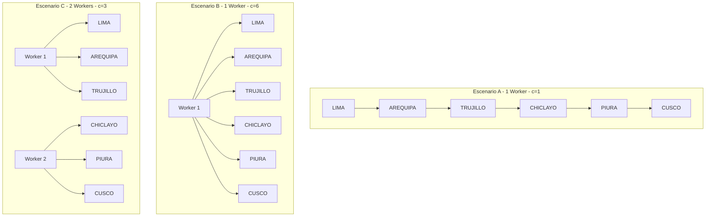

# Ejercicio Académico – Airflow (Paralelismo de Workers)

## 📄 Enunciado

Una empresa de delivery tiene un DAG con 6 tasks independientes entre sí (sin dependencias unas de
otras), cada una simulando la generación de un reporte de una ciudad distinta (Lima, Arequipa, Trujillo,
Chiclayo, Piura, Cusco), y cada una tarda aproximadamente 10 segundos en "correr" (usen
time.sleep(10) dentro de la task para simularlo). Construyan ese DAG desde cero, y midan cuánto
tiempo total tarda en completarse bajo tres configuraciones distintas de capacidad de worker.

### OBJETIVO
Comprobar con números reales, no solo en teoría, cómo cambia el tiempo total de un DAG al variar la
capacidad de paralelismo disponible — y entender la diferencia entre escalar worker_concurrency de
un solo worker vs. escalar el número de réplicas de worker.

### RESTRICCIONES O CONDICIONES
Deben correr el mismo DAG (sin tocar su código) bajo tres configuraciones: (a) 1 worker con
worker_concurrency=1 , (b) 1 worker con worker_concurrency=6 , y (c) 2 workers con
worker_concurrency=3 cada uno.
Midan el tiempo total de cada corrida con Measure-Command en PowerShell, envolviendo el comando
airflow dags trigger más una espera hasta que el DAG termine (pueden usar airflow dags
list-runs en un loop simple para confirmar el estado, o revisar la UI).
Todos los comandos que escriban directamente en Windows (fuera de docker compose exec ) deben
ser PowerShell válido.

### RESULTADO ESPERADO
Un archivo README.md dentro de su carpeta de entrega con: el código del DAG, los 3 tiempos medidos,
y 2-3 párrafos explicando en sus propias palabras por qué el resultado fue el que fue — en particular, si
(b) y (c) dieron un tiempo parecido o distinto, y por qué.

## 📄 Código del DAG

```python
from airflow.decorators import dag, task
from datetime import datetime
import time

FECHA_INICIO = datetime(2026, 9, 1)

CIUDADES = ["lima", "arequipa", "trujillo", "chiclayo", "piura", "cusco"]

@dag(
    dag_id="reportes_ciudades",
    schedule=None,
    start_date=FECHA_INICIO,
    catchup=False,
    tags=["pede9", "clase4", "ejercicio1", "paralelismo"],
)
def reportes_ciudades():

    for ciudad in CIUDADES:
        @task(task_id=f"reporte_{ciudad}")
        def generar_reporte(ciudad=ciudad):
            print(f"[{ciudad}] generando reporte...")
            time.sleep(10)  # simula trabajo pesado
            print(f"[{ciudad}] reporte listo")
            return f"Reporte de {ciudad} completado"

        generar_reporte()

reportes_ciudades()
```

## ⚙️ Configuraciones probadas

Escenario A → 1 worker con worker_concurrency=1

Tiempo medido en UI: 62.86 segundos 

Escenario B → 1 worker con worker_concurrency=6

Tiempo medido en UI: 14.15 segundos

Escenario C → 2 workers con worker_concurrency=3 cada uno

Tiempo medido en UI: 15.68 segundos

## 🖥️ Comandos utilizados
### Levantar cada escenario

```shell
docker compose down
docker compose -f docker-compose.yml -f docker-compose.override.a.yml up -d
# cambiar override.a.yml por docker-compose.override.b.yml o docker-compose.override.c.yml según el caso
```

### Ejecutar DAG

```shell
docker compose exec airflow-scheduler airflow dags trigger reportes_ciudades
```

## 📊 Diagrama de distribución 




## 📊 Explicación de resultados

En el escenario A, donde se utilizó un solo worker con `worker_concurrency=1`, el tiempo de ejecución fue de 62.86 segundos. Esto se debe a que las tareas se procesaron prácticamente de manera secuencial, es decir, el worker solo podía ejecutar una tarea a la vez. Al aumentar la concurrencia a 6 en el escenario B, el tiempo disminuyó considerablemente hasta 14.15 segundos, ya que el mismo worker pudo ejecutar varias tareas simultáneamente. Esto demuestra que, cuando las tareas son independientes y existe capacidad suficiente de recursos, aumentar el nivel de concurrencia puede reducir significativamente el tiempo total del procesamiento.

En el escenario C se utilizaron dos workers, cada uno con `worker_concurrency=3`, obteniendo un tiempo de 15.68 segundos. Este resultado fue muy parecido al escenario B, que obtuvo 14.15 segundos, porque en ambos casos existe una capacidad teórica de ejecutar hasta 6 tareas concurrentemente. La pequeña diferencia puede explicarse por el overhead adicional de administrar y coordinar dos workers, así como por la distribución de las tareas y el consumo de recursos del sistema. Por lo tanto, en esta prueba no se observó una ventaja significativa de utilizar dos workers frente a un solo worker con mayor concurrencia; ambos enfoques lograron un nivel de paralelismo similar, aunque el escenario B presentó ligeramente mejor tiempo de ejecución.

## ✅ Notas metodológicas

Los tiempos oficiales para el informe deben tomarse desde la UI de Airflow (columna Run Duration).

Para reproducir los escenarios: siempre ejecutar docker compose down antes de levantar un nuevo override.

